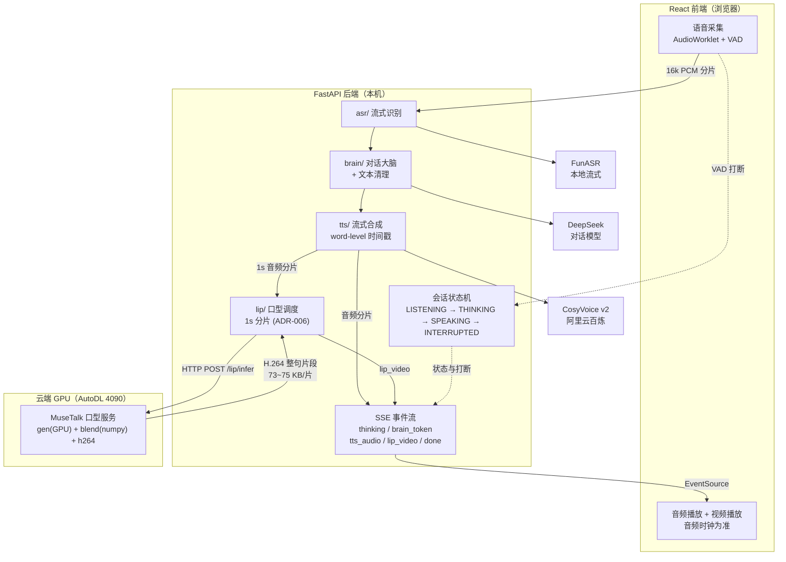

# 企业级数字人

> **一句话定位**：浏览器里说一句话，数字人开口应答 —— 端到端 **1.18s**（目标 < 2s），口型片段产出 **RTF 0.71**（快于音频播放，队列不积压）。
> 全链路**自研编排**（FastAPI + 显式会话状态机），口型推理跑在云端 GPU，本机只做编排与播放。

---

## 核心指标

> **唯一入口是评估台账** `docs/eval-history.md`（口径 / 环境 / 脚本三要素齐全）。
> 下表只是摘要，每个数字都标了实测日期，以台账为准。

| 维度 | 指标 | 实测 | 目标 | 状态 |
|---|---|---|---|---|
| 延迟 | **端到端**（说完 → 首包开口） | **1183ms**（6 轮均值，min 977 / max 1407，2026-09-14） | < 2s | ✅ |
| 延迟 | LLM 首 token | ~740ms（503~1108ms 波动，2026-09-02） | < 800ms | ✅ |
| 延迟 | ASR 单块处理 | 166ms（CPU RTF 0.27，2026-09-02） | ≤ 300ms | ✅ |
| 延迟 | ASR 首字端到端 | ≈ 766ms（600ms 分片粒度下，2026-09-02） | — | ⚠️ 见下 |
| 延迟 | TTS 首包 | **618ms**（2026-09-14） | < 300ms | ❌ **未达标** |
| 延迟 | 口型单片（云 GPU） | **711~737ms / RTF 0.72~0.74**（2026-09-23） | RTF < 1 | ✅ |
| 延迟 | 口型首帧 | 待测 | < 400ms | ⏳ |
| 吞吐 | ASR 流式字准率（干净音频） | 100%（7/7，CER 0.000，2026-09-17） | — | ✅ |
| 资源 | 云 GPU 显存 | 7064 MiB（模型 + 536 帧 avatar 缓存，2026-09-14） | 24G 卡 | ✅ |
| 资源 | 云↔本机隧道带宽 | **0.96 MB/s 下行 / 0.46 MB/s 上行**（2026-09-14） | — | ⚠️ 链路层硬限 |
| 音画同步 | 口型片段到达偏差（1s 分片后） | 首片 **+205ms**，13/13 片**提前到达**（2026-09-14） | — | ✅ |
| 稳定性 / 并发 | 30 分钟不掉帧 / 单卡路数 | 待测 | — | ⏳ |

**两处如实说明**：① **TTS 首包 618ms 未达 300ms 目标**（CosyVoice v2 WebSocket 首片实测），是当前端到端里唯一未达标的分段；② **ASR「首字端到端 ≤300ms」原目标在 600ms 分片粒度下不成立**，仅"单块处理"成立（EVAL-P1 v1.2 已修正口径）。

---

## 架构



**数据流一句话**：语音 → 流式 ASR → LLM 流式出字 → TTS 流式出音频（**首包即播**）→ 同一路音频按 1s 分片送云端口型 → H.264 片段经 SSE 回前端 → 按音频时钟调度播放。

### 延迟分解（实测，非目标值）

```mermaid
gantt
    title 一次真实提问的耗时构成（实测口径，2026-09-14 / 09-23）
    dateFormat X
    axisFormat %s
    section 首包路径
    ASR 识别（分片）        :a1, 0, 166
    LLM 首 token            :a2, 166, 740
    TTS 首包                :a3, 906, 618
    section 口型（并行，不阻塞开口）
    云端口型单片 711ms      :b1, 1524, 711
    传输隧道 0.96MB/s       :b2, after b1, 300
```



| 分段 | 实测 | 说明 |
|---|---|---|
| ASR 单块 → 首字端到端 | 166ms / ≈766ms | 600ms 分片粒度 |
| LLM 首 token | ~740ms | 流式 |
| TTS 首包 | 618ms | **即开口时刻**，与口型并行 |
| **→ 端到端（首包开口）** | **1183ms** | 达标（< 2s） |
| 口型单片（并行支路） | 711ms / RTF 0.71 | 快于音频播放，不积压 |
| 云↔本机隧道 | 0.96 MB/s | 链路层硬限（非协议层，见 ADR-005） |

> **关键是并行而非串行累加**：TTS 首包一出就开始播放，口型走独立支路追赶音频时钟。

---

## 工程要点（可讲的部分）

| 要点 | 做法 | 依据 |
|---|---|---|
| **口型链路提速** | 把官方 PIL 融合换纯 numpy 等价实现（逐像素 maxdiff=0），云侧片耗时 1065 → 711ms、RTF 1.065 → 0.71 | ADR-010、RUNBOOK §3.20 |
| **为什么不上 GPU 做融合** | 实测 1.0×：每帧要过 PCIe 5.7MB，真实计算仅 362×362×3 —— 瓶颈是搬运不是算力 | 同上（E3/E4 对照） |
| **为什么不做帧级/WebRTC 重写** | 瓶颈在实现不在架构；帧级会把 SSE 事件数 11 → 300；WebRTC 属 P2（链路层才是硬限） | ADR-010 |
| **口型传输选 H.264 整句片段** | 逐帧 JPEG 15.52MB/8s → H.264 387KB，**41×** | ADR-005 |
| **按 1s 音频分片送检** | 首片偏差 5274ms → **205ms**；服务 URL 禁用 `localhost`（本机解析 2s/次） | ADR-006、RUNBOOK 坑 20 |
| **打断归属前端** | VAD/端点检测在浏览器 AudioWorklet，后端只"收到音频就识别" | ADR-004 |
| **不引开源整包** | 编排/状态机/TTS 清洗全部自研，依赖只在模型层 | ADR-002 |
| **文档与代码同寿命** | PRD / DESIGN / ADR / 进度 / 台账分离；**量化指标只进台账**，其余文档只引用 | `docs/docs-guide.md` |

---

## 快速开始

```bash
# 1) 后端（本机）—— 需先在 backend/.env 配好 DASHSCOPE_API_KEY 等
cd backend
.venv/Scripts/python.exe -m uvicorn api.routes:app --host 127.0.0.1 --port 8010

# 2) 前端（本机）
cd frontend && npm install && npm run dev        # http://127.0.0.1:5173
```

**需要口型画面时**（云 GPU）：

```bash
# AutoDL 控制台开机（选"有卡模式"）后，一键恢复服务 + 隧道
bash backend/deploy/restore-cloud-lip.sh <SSH端口>
```

**验证服务状态**：`curl http://127.0.0.1:8010/api/v1/health` → `lip_service.reachable` 应为 `true`。

> 环境搭建的完整细节与全部已知坑见 `docs/RUNBOOK-环境记录.md`（含"关机不丢东西/换镜像会丢"等）。

## 30 分钟演示脚本

| 分钟 | 内容 | 看点 |
|---|---|---|
| 0–3 | 启动：后端 + 前端 + `restore-cloud-lip.sh` | `health` 里 `lip_service.reachable: true`、云端 `frames_cached: 536` |
| 3–8 | 文字提问走通全链路 | 后台日志逐段打点：ASR / LLM / TTS / 口型 rtf |
| 8–15 | 语音提问 + 打断 | 说话即打断（ADR-004 前端 VAD）；打断后 SSE 立即停止产出 |
| 15–22 | **技术工作台**（`/studio`） | 实时延迟分解、口型片段、队列水位、`lip_dropped` |
| 22–27 | **评估台账**（`/metrics`、`/ledger`） | 每行指标的「口径 + 环境 + 脚本」三要素 |
| 27–30 | 打开 `docs/03-决策/` | 每个关键选择的被否方案与实测依据（ADR-005/006/010） |

## 目录结构

```
backend/    FastAPI 后端（api / asr / brain / tts / lip / eval）+ deploy（云侧口型服务与运维脚本）
frontend/   React 前端（学习首页 / 对话页 / 技术工作台 / 评估视图）
docs/       全部文档（见下方文档地图）；文档规范见 docs/docs-guide.md
```

## 文档地图

| 文档 | 类型 | 状态 | 链接 |
|---|---|---|---|
| 需求与验收标准（MUST） | 需求 | 已定稿 | `docs/01-需求/PRD-实时交互数字人助手.md` |
| 架构方案 | 方案 | 已定稿 | `docs/02-方案/DESIGN-实时交互链路架构.md` |
| 打断时序与状态机 | 方案 | 已定稿 | `docs/02-方案/DESIGN-打断时序与状态机转移表.md` |
| 接口与协议规范 | 方案 | v1.10 | `docs/02-方案/SPEC-接口与协议规范.md` |
| 决策记录（只增不改） | 决策 | 10 篇 | `docs/03-决策/ADR-*.md` |
| 进度 | 进度 | 每阶段一份 | `docs/04-进度/PROGRESS-*.md` |
| **评估台账（指标唯一入口）** | 台账 | 演进 | `docs/eval-history.md` |
| 环境记录与踩坑 | 运维 | 演进 | `docs/RUNBOOK-环境记录.md` |
| 文档总索引 | — | — | `docs/README.md` |
