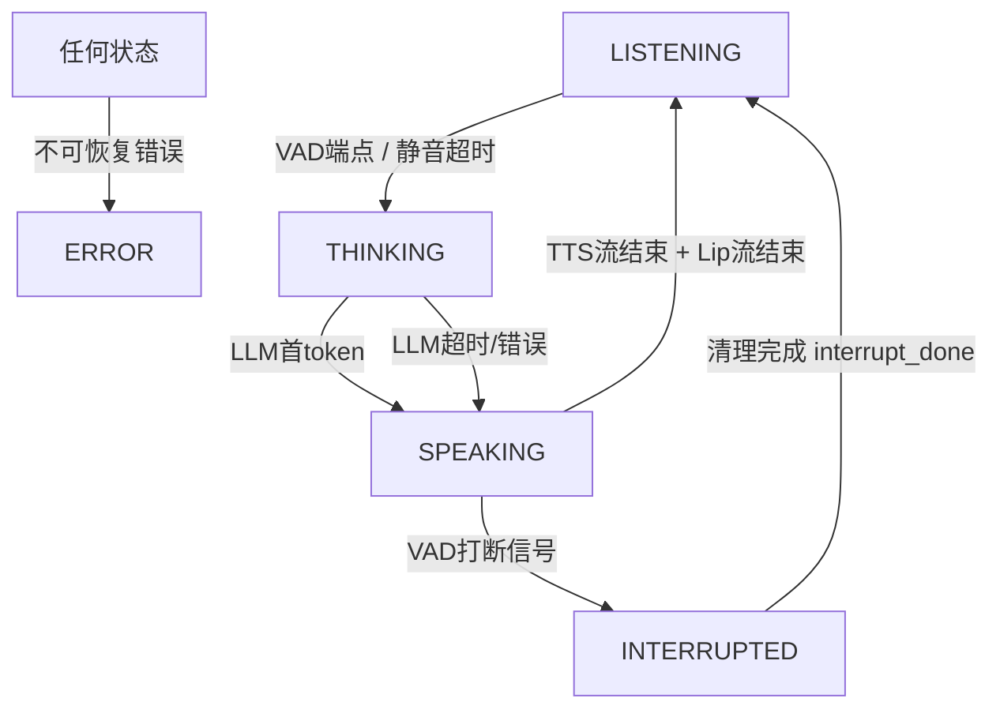
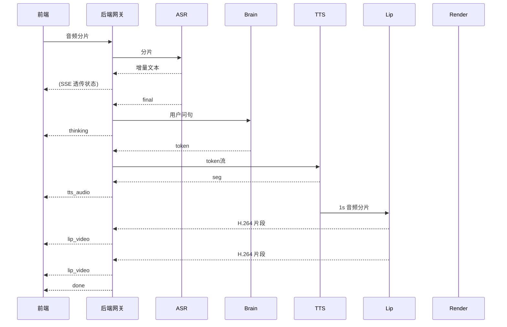
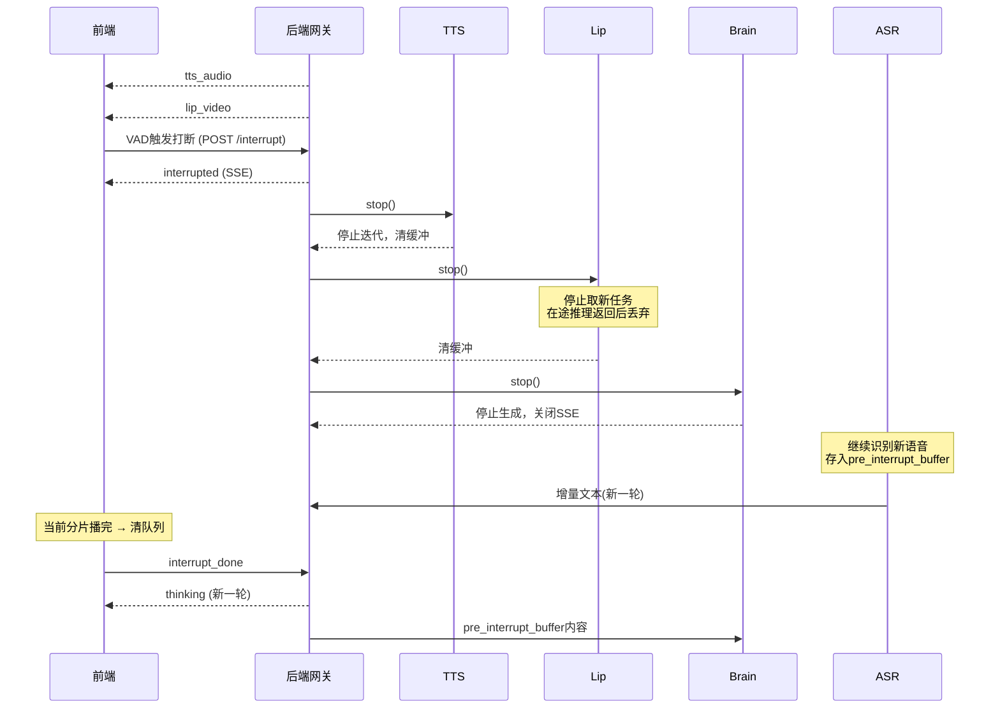

# 《打断时序与状态机转移表》完整版

> 文件名：`DESIGN-打断时序与状态机转移表.md`
> 类型：design
> 状态：已完成（v1.0 已定稿）
> 日期：2026-09-01
> 关联：SPEC-接口与协议规范.md §3.3、DESIGN-实时交互链路架构.md §4.1
> 读者：后端开发（状态机实现）、联调测试
> 结论：定义 VAD 打断的完整时序、状态转移表、缓冲区清理协议，作为状态机代码实现的依据

------

## 1. 目标与约束（MUST）

定义 VAD（语音活动检测）触发打断时，全链路各模块的**行为时序**和**状态转移规则**。核心解决三个问题：

1. 已入队未播放的 TTS 分片 → 怎么处理？
2. 正在 GPU 上推理的口型帧 → 怎么处理？
3. ASR 正在接收的新语音 → 怎么衔接？

**本规范定稿后，`api/state_machine.py` 可直接按状态转移表实现。**

约束：

- P1 阶段 VAD 由前端实现（见 ADR-004），后端通过 HTTP 打断信号驱动状态机
- 状态机为单会话内存态（SessionContext，见 SPEC §2），不做跨会话共享

------

## 2. 引用的决策（MUST）

| ADR | 一句话引用（理由见对应 ADR） |
|---|---|
| ADR-004 VAD 归属 | P1 前端 AudioWorklet 实现 VAD + HTTP 打断信号；P2 评估迁移后端（与 ASR 共享音频流） |
| ADR-001 环境策略 | 口型/语音合成推理实验在云 GPU 完成 |

------

## 3. 系统流程（HUMAN）

### 3.1 状态定义

| 状态          | 说明                             | 允许的输入                           |
| :------------ | :------------------------------- | :----------------------------------- |
| `LISTENING`   | 聆听用户语音，ASR 流式识别中     | 用户语音分片 / VAD 端点              |
| `THINKING`    | 调用 LLM 生成回复，等待首 token  | LLM 流式 token                       |
| `SPEAKING`    | TTS + 口型 + 播放中              | TTS 分片 / 口型帧 / **VAD 打断信号** |
| `INTERRUPTED` | 被打断后的短暂清理期（不可中断） | 清理完成信号（`interrupt_done`）     |
| `ERROR`       | 任何环节发生不可恢复错误         | 用户重试或关闭会话                   |

### 3.2 状态转移图



### 3.3 关键规则

#### 规则1：打断信号的传播方向

```
VAD检测到用户插话
        │
        ▼
   ┌────────────┐
   │  前端发送  │  interrupt信号（HTTP POST /interrupt）
   │ 打断信号   │
   └─────┬──────┘
         │
         ▼
   ┌────────────┐
   │  后端接收  │  1. 状态: SPEAKING → INTERRUPTED
   │  中断信号   │  2. 沿流水线反向传播:
   └─────┬──────┘     TTS ← Brain ← ASR
         │            3. 各段停止产出新数据
         ▼            4. 清空各段内部缓冲
   ┌────────────┐
   │ 缓冲区清理 │  TTS队列:  丢弃所有未播放分片
   │  (三段式)  │  Lip队列:  丢弃已完成等待发送的帧（在途GPU推理不取消，返回后丢弃）
   │            │  播放器:   当前分片播完，清空队列
   └─────┬──────┘
         │
         ▼
   ┌────────────┐
   │  进入      │  状态: INTERRUPTED → LISTENING
   │  LISTENING │  （等待前端调用 interrupt_done 确认）
   └────────────┘
```

#### 规则2：分片/帧的丢弃策略

| 对象           | 位置                           | 处理方式                                                     | 理由                                                         |
| :------------- | :----------------------------- | :----------------------------------------------------------- | :----------------------------------------------------------- |
| **TTS分片**    | 已发送到前端但未播放           | 前端丢弃（收到 `interrupted` 事件后，当前分片播完，清空播放队列） | 前端最清楚播放进度                                           |
| **TTS分片**    | 已合成但未发送（后端队列）     | 后端清空                                                     | 减少网络传输                                                 |
| **TTS分片**    | 正在合成中（TTS模块内部）      | TTS收到stop信号→停止迭代→清空内部缓冲                        | 释放GPU/CPU资源                                              |
| **口型帧**     | 已发送到前端但未渲染           | 前端丢弃（按`pts_ms`判断，若已落后音频时钟则丢弃）           | 同步机制本身就支持丢弃落后帧                                 |
| **口型帧**     | 已完成推理但未发送（后端队列） | 后端清空                                                     | 同上                                                         |
| **口型帧**     | **正在GPU上推理中**            | ❌ **不取消**，等返回后丢弃（不发送）                         | PyTorch/CUDA没有安全的"取消推理"API；强行中断会导致CUDA上下文损坏 |
| **ASR**        | 正在流式识别中                 | 继续识别，结果存入 `pre_interrupt_buffer`，不进入本轮对话    | ASR不能"停止"，否则会丢后续语音                              |
| **Brain**      | 正在流式生成LLM token          | 收到stop信号→停止迭代→关闭SSE流                              | 节省token成本                                                |
| **用户新语音** | 插话发生时刻之后的音频         | **不额外延迟**，从 `pre_interrupt_buffer` 取数据直接进入新一轮 | 这是打断的核心体验目标                                       |

#### 规则3：最后一个分片"允许播完"的例外

**规则**：若打断触发时，某个TTS分片已经**正在从扬声器发出声音**（即前端已开始播放），则允许该分片播完。

**原因**：立即截断会产生"爆音"（音频波形被截断的咔嗒声），体验更差。

**实现方式**：前端播放器维护一个 `is_playing` 状态，收到 `interrupted` 事件后：

1. 立即停止接收新的 TTS 分片
2. 当前正在播放的分片**继续播完**
3. 播放完成后立即清空播放队列 → 调用 `POST /interrupt_done`

```javascript
// 前端伪代码
class AudioPlayer {
  onInterrupted() {
    this.stopAcceptingNewChunks = true;  // 不再入队新分片
    // 当前分片继续播放，播放完成回调中清空队列并发送 interrupt_done
  }
  onCurrentChunkEnd() {
    if (this.stopAcceptingNewChunks) {
      this.clearQueue();
      this.sendInterruptDone();  // 通知后端清理完成
    }
  }
}
```

### 3.4 时序图

#### 3.4.1 正常流程（无打断）



#### 3.4.2 打断流程（SPEAKING → INTERRUPTED → LISTENING）



------

## 4. 接口定义（MUST）

### 4.1 状态转移表（实现用）

| 当前状态      | 触发事件                          | 目标状态      | 动作                                                         | 是否允许 |
| :------------ | :-------------------------------- | :------------ | :----------------------------------------------------------- | :------- |
| `LISTENING`   | ASR 端点（`is_final=True`）       | `THINKING`    | 发送用户完整文本到 Brain                                     | ✅        |
| `LISTENING`   | 用户静音超时（前端 VAD，1.2s；**静音阈值自适应**，ADR-004） | `THINKING`    | 同 ASR 端点（兜底）                                          | ✅        |
| `THINKING`    | LLM 首 token 返回                 | `SPEAKING`    | 触发 TTS 合成，启动流式输出                                  | ✅        |
| `THINKING`    | LLM 超时（>1.5s）                 | `SPEAKING`    | 触发**降级话术 TTS**（预设文案："抱歉，我思考了一下，请您再说一遍？"）→ 播完后进入 LISTENING | ✅        |
| `THINKING`    | LLM 错误                          | `SPEAKING`    | 同超时处理（降级话术）                                       | ✅        |
| `SPEAKING`    | VAD 打断信号（前端判据：`rms > max(底噪×8, 0.03)` 且**连续 2 帧=200ms**） | `INTERRUPTED` | 执行 §3.3 规则2 清理协议；发送 SSE `interrupted` 事件          | ✅        |
| `SPEAKING`    | TTS 流结束 + Lip 流结束           | `LISTENING`   | 发送 `done` 事件，等待下一轮                                 | ✅        |
| `INTERRUPTED` | 收到 `interrupt_done`（清理完成） | `LISTENING`   | 关闭旧 SSE 流（若还在发），打开新流                          | ✅        |
| `INTERRUPTED` | 收到新的打断信号                  | `INTERRUPTED` | **忽略**，继续保持清理中                                     | ❌        |
| `SPEAKING`    | 收到用户语音分片（VAD 未触发）    | `SPEAKING`    | 缓存到 `pre_interrupt_buffer`，打断触发后再处理              | ⚠️        |
| `任何状态`    | 不可恢复错误                      | `ERROR`       | 返回错误事件 + 关闭会话                                      | ✅        |

### 4.2 打断相关接口（详见 SPEC-接口与协议规范.md §5）

| 端点 | 用途 |
|---|---|
| `POST /api/v1/session/{session_id}/interrupt` | 前端 VAD 触发打断信号（等价于自动打断，后端行为一致） |
| `POST /api/v1/session/{session_id}/interrupt_done` | 前端完成播放清理后确认，后端完成 `INTERRUPTED → LISTENING` |

### 4.3 中断期间语音数据的处理（边界场景）

**场景**：用户开始插话，但 VAD 判定需要 300ms 才能确认"确实在说话"。这 300ms 内的语音数据如何处理？

**决策**：**不丢弃，存入 `pre_interrupt_buffer`**。

```
时间轴:
T=0     用户开始插话
T=100   ASR 收到第一个语音分片（暂存到 pre_interrupt_buffer）
T=300   VAD 确认打断 → 触发 INTERRUPTED
        → 将 pre_interrupt_buffer 中的分片取出，作为新一轮 LISTENING 的输入起点
        → 不丢失用户说的前 300ms
```

**实现方式**：ASR 模块维护一个 `pre_interrupt_buffer`，打断触发时：

1. 该缓冲区内容不进入本轮对话
2. 状态转为 `LISTENING` 后，该缓冲区内容**作为新一轮的第一批输入**喂给 Brain
3. 后续新到的语音分片正常追加

### 4.4 实现检查清单

- □ `api/state_machine.py` 实现状态转移表（§4.1）
- [x] TTS / Lip / Brain 停止产出（2026-09-15 实现，机制与设计不同但语义等价）：
  未在各模块内实现 `stop()`，而是**在编排层收口**——`/interrupt` 置位 `SessionContext.stop_requested`，
  `chat_stream` 生成器每轮循环检查到即 `break`，`finally` 里取消 llm/tts/lip 三个 task（取消即停止迭代、
  相当于各段的 stop()）。理由：三个 task 的生命周期本来就由生成器持有，模块内加 stop() 会引入跨层状态。
- □ Lip 模块支持 `stop()` 方法：
  - 立即停止接收新的 TTS 分片（阻止新推理入队）
  - 标记当前正在进行的 GPU 推理为"待丢弃"，返回后不发送
  - 清空已完成的帧缓冲（未发送的丢弃）
  - ⚠️ 不强行中断 CUDA 内核（PyTorch 无安全取消 API）
- □ Brain 模块支持 `stop()` 方法：停止 LLM 流式生成 + 关闭 SSE 流
- ⛔ ASR 模块支持 `pre_interrupt_buffer` 机制（§4.3）——**仍未实现（2026-09-15 复核）**：
  **前端侧已修**：`useMicCapture` 新增 `barge` 模式，播报期间自动开一路只跑 VAD 的采集（不再"没有采集"）。
  但该模式**不上行 ASR**，后端拿不到插话音频，缓冲仍无从谈起 → 等在线链路（WebRTC DataChannel，SPEC §4.4）
  跑通后再评估：若届时前端在打断瞬间把已采集的音频补送给后端，本机制才有意义。
  详见 `PROGRESS-2026-09-15-实时链路接入与口型上云.md` 阻塞节。
- [x] 前端播放器 `onInterrupted()`（2026-09-15 实现）：`stopPlayback()` 对 Web Audio 播放链做 **20ms 淡出**后
  `stop()` 所有已排期分片 + 关闭 AudioContext（等效"当前分片播完、清空队列"，且更快、不产生截断爆音）；
  同时 `resetLip()` 停口型、`closeRef()` 关 SSE，再调 `/interrupt` 与 `/interrupt_done`。
  ⚠️ 播放用的是**排到时间轴**的 `AudioBufferSourceNode`，不显式 `stop()` 就会继续播完——
  这正是"插话了数字人还在说"的直接原因。
- [x] 后端在 `INTERRUPTED` 状态时忽略新的打断信号（2026-09-15 起对外可区分：返回 `{"status":"ignored"}`，
  修复前同样返回 `interrupted`，前端无法判断本轮打断是否生效）
- □ 单元测试：状态转移各路径覆盖（含边界条件）

------

## 5. 非功能需求（MUST）

### 5.1 打断响应时序约束

| 环节 | 阈值 | 超时后行为 |
|---|---|---|
| 打断信号传播（前端 VAD → 后端状态转移） | < 200ms | 超时打点记录，不阻塞 |
| `interrupt_done` 等待 | 前端播完当前分片为止 | 前端控制，无固定超时 |
| 新一轮首响应（打断后 → 用户新语音被识别） | 不额外延迟 | `pre_interrupt_buffer` 直接作为新一轮输入 |

### 5.2 可靠性约束

- GPU 在途推理不取消（无安全取消 API），返回后丢弃——这是"清理协议"的硬边界
- 打断期间 `INTERRUPTED` 状态不可中断（新打断信号忽略）
- 状态机所有转移路径必须覆盖单元测试（含边界条件）

------

## 附录：版本与变更管理

| 版本     | 日期           | 变更内容                                                     | 作者 |
| :------- | :------------- | :----------------------------------------------------------- | :--- |
| v0.1     | 2026-09-01     | 初稿                                                         | -    |
| **v1.0** | **2026-09-01** | **定稿：修正GPU推理"停不停"矛盾、LLM超时转移、VAD归属决策、时序图改Mermaid** | - |
| **v1.1** | **2026-09-15** | **口径收口：§4.1 静音超时阈值由「>2s」改为「前端 VAD 当前 1.2s（ADR-004）」，与实现（`useMicCapture.ts SILENCE_MS`）对齐** | - |
